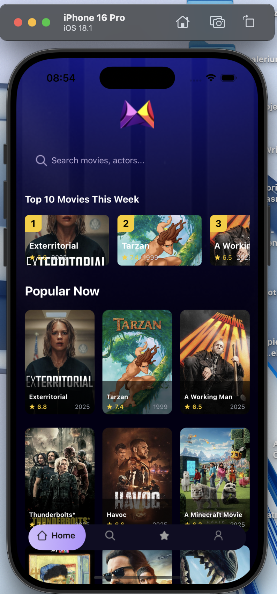
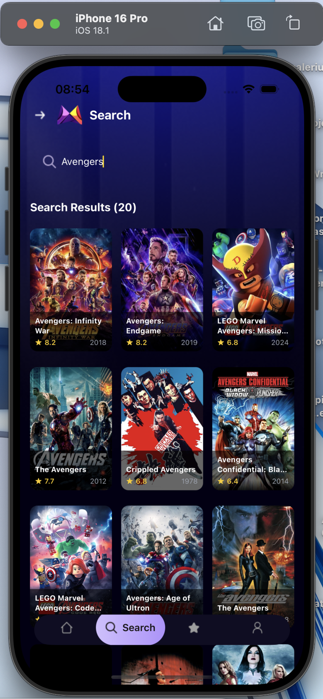
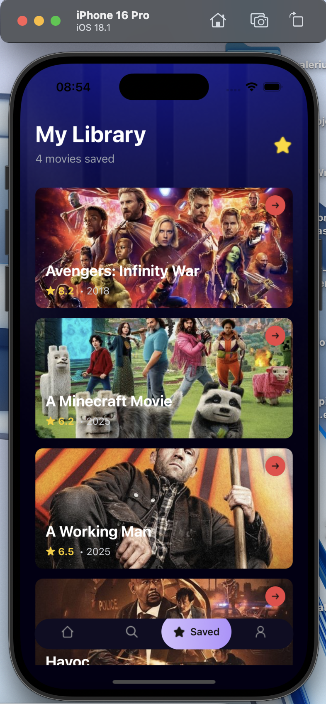
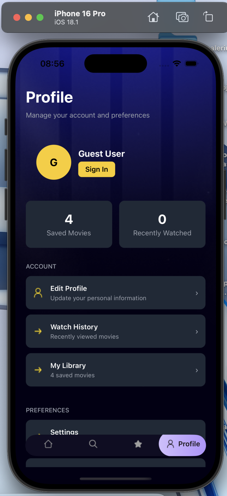

# 📱 Movie App 

<p align="center">
  
</p>

## 📖 Proje Hakkında

Movie App, film severler için geliştirilmiş modern basic mobil uygulamadır. React Native ve Expo teknolojileri kullanılarak oluşturulmuştur. Bu uygulama sayesinde popüler filmleri keşfedebilir, film arayabilir, favori filmlerinizi kaydedebilir ve profilinizi yönetebilirsiniz.

## ✨ Özellikler

- 🏠 **Ana Sayfa**: Popüler filmler ve haftanın en çok izlenen filmlerini görüntüleme
- 🔍 **Arama**: Film adına göre arama yapabilme
- ⭐ **Kaydetme**: Favori filmleri kaydedebilme ve daha sonra erişebilme
- 👤 **Profil**: Kullanıcı profili ve uygulama ayarları

## 📋 Ekranlar ve İşlevleri

### Ana Sayfa (Home)
<p align="center">
  
</p>

- Popüler filmler listesi
- Haftanın top 10 filmi
- Film detaylarına kolay erişim
- Arama fonksiyonuna hızlı geçiş

### Arama (Search)
<p align="center">
  
</p>

- Gerçek zamanlı film arama
- Arama sonuçlarını grid görünümünde listeleme
- Film detaylarına hızlı erişim

### Kaydedilenler (Saved)
<p align="center">
  
</p>

- Kaydedilen filmleri görüntüleme
- Kayıtlı filmleri kolayca silme
- Boş durum bildirimi ve keşfetme önerisi

### Profil (Profile)
<p align="center">
  
</p>

- Kullanıcı bilgileri
- İstatistikler (kaydedilen filmler, son izlenenler)
- Uygulama ayarları
- Yardım ve destek seçenekleri

## 🛠️ Teknolojiler

- **Framework**: React Native
- **Geliştirme Ortamı**: Expo
- **API**: TMDB (The Movie Database)
- **Veri Yönetimi**: AsyncStorage
- **Stil**: Tailwind CSS (NativeWind)
- **Navigasyon**: Expo Router

## 🚀 Kurulum

1. Repo'yu klonlayın:


2. Bağımlılıkları yükleyin:
```bash
npm install
```

3. Expo'yu başlatın:
```bash
npx expo start
```

## 📱 Kullanım

- Ana sayfada popüler filmleri keşfedin
- Arama bölümünden dilediğiniz filmi arayın
- Film detaylarını görüntülemek için film kartına tıklayın
- Beğendiğiniz filmleri kaydetmek için yer işareti simgesine tıklayın
- Kaydedilen filmlerinizi "Saved" sekmesinde görüntüleyin
- Profil sayfasından ayarlarınızı yönetin


## 👨‍💻 Geliştirici

Murat Eyvazli - [GitHub](https://github.com/MuradEyvazli) - [LinkedIn](https://tr.linkedin.com/in/murad-eyvazli-4342492b1)